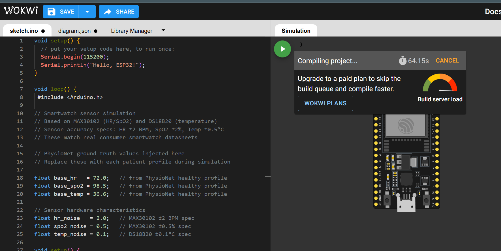
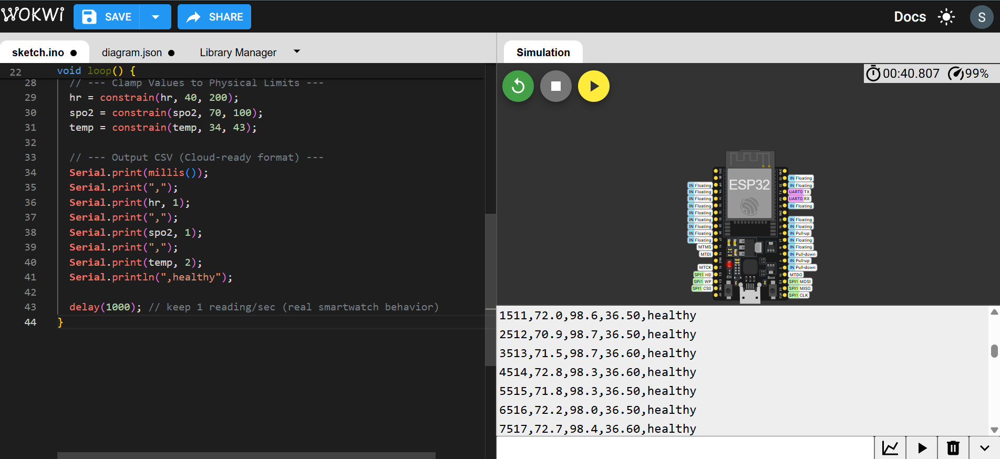
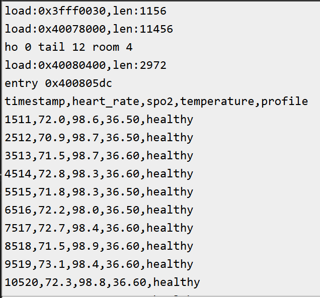

# Smart Healthcare Prediction System

## Overview

A machine learning-based healthcare prediction system that combines wearable sensor data from an ESP32 prototype with patient health information to assist in recommending whether a specialist consultation is required.

The project demonstrates how IoT devices and machine learning can work together to support early healthcare decision-making.

---

## Features

- ESP32 wearable sensor simulation
- Heart Rate and SpO2 monitoring
- Healthcare prediction using Machine Learning
- Google Colab implementation
- Model evaluation with classification report
- Wokwi hardware simulation

---

## Technologies Used

- Python
- Google Colab
- Scikit-learn
- Pandas
- NumPy
- ESP32
- Wokwi Simulator

---

## Project Structure

```
Smart-Healthcare-Prediction-System
│
├── healthcare_prediction.ipynb
├── sketch.ino
├── diagram.json
├── wokwi-project.txt
├── README.md
└── screenshots
    ├── esp32_simulation1.png
    ├── esp32_simulation2.png
    └── model_results.png
```

---

## Model Performance

Accuracy: **92.6%**

Classification Report:

- Precision: 0.93
- Recall: 0.93
- F1 Score: 0.92

---

## Screenshots

### ESP32 Simulation



### Sensor Output



### Machine Learning Results



---

## Future Improvements

- Real wearable device integration
- Cloud deployment
- Live patient monitoring
- Specialist appointment recommendation
- Mobile application support

---

## Author

Saundarya Sharma
